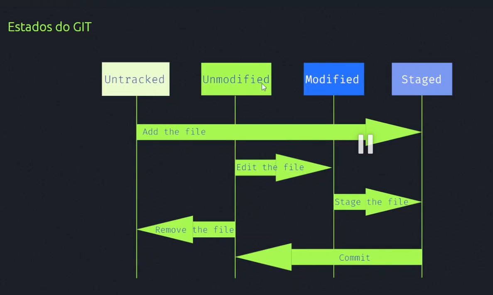
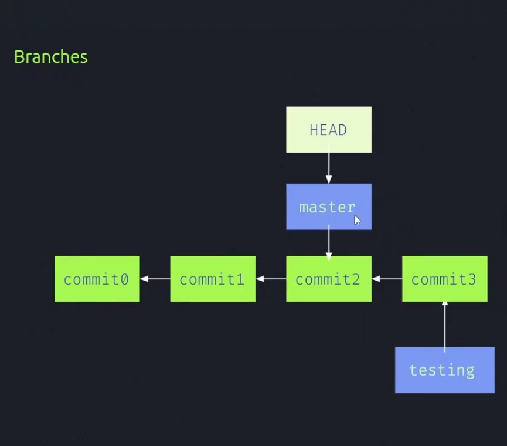

# O que é git?
Git é um sistema de controle de versões distribuído, usado principalmente no desenvolvimento de software, mas pode ser usado para registrar o histórico de edições de qualquer tipo de arquivo.

## Comandos Básicos introduzido no Curso
* `git init` -> inicia um repositório git;
* `git status` -> permite visualizar o estado de um arquivo;
* `git add` -> Coloca o arquivo ou repositório modificado no estado preparatório para realizar um commit;
* `git commit` -> Salva as modificações do arquivo;
* `git diff` -> mostra onde ocorreram as modificações no arquivo;
* `git log` -> mostra todos os commits realizados;
* `git restore` -> restaura para o estado anterior: Use 'git restore --staged [nome do arquivo]' para sair do estado staged e voltar para o estado modified.
* `git push` -> envia o arquivo da origin para os branches;
* `git pull` -> baixa o arquivo do branch para a máquina local. OBS: usando o 'git pull' dessa forma, a fusão dos arquivos locais com o que está sendo baixado ocorre automaticamente, caso queira analisar as alterações faça um 'git fetch';
* `git fetch` -> faz um pull sem a fusão automática;

## o que são Branch?
Ramificação, no controle de versão e gerenciamento de configuração de software, é a duplicação de um objeto sob controle de versão. Cada objeto pode ser modificado separadamente e em paralelo para que os objetos se tornem diferentes. Nesse contexto, os objetos são chamados de branches.

### Como criar uma branch?
Por meio dos comando a seguir:
* `git branch [nome da branch]` -> cria uma nova branch;
* ` git log --oneline --decorate` -> Indica para qual branch o ponteiro `head` irá apontar;
* `git checkout [nome da branch]` -> Entra para dentro de uma branch.

  

